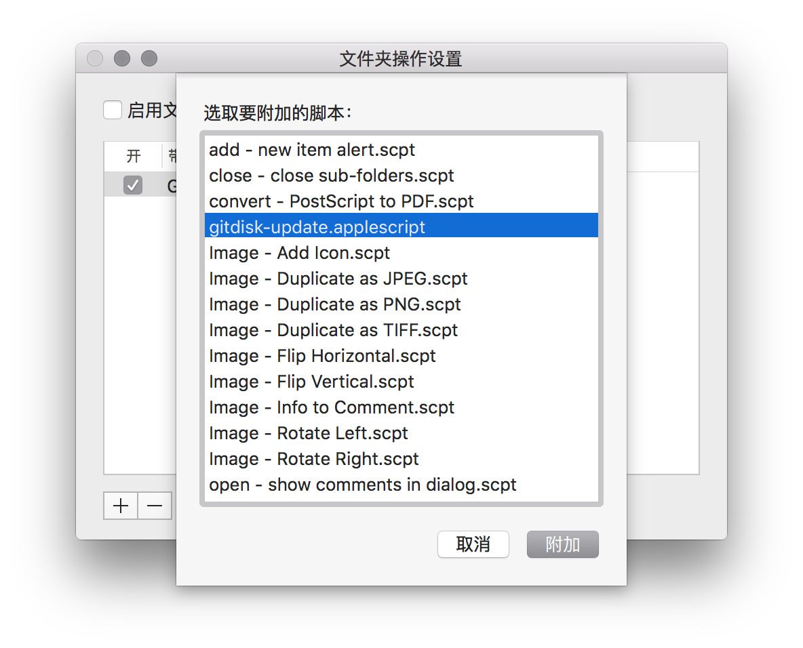
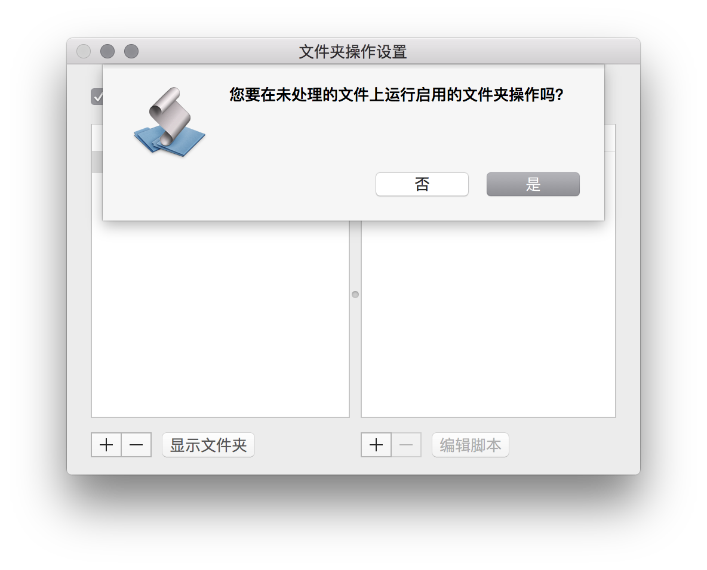
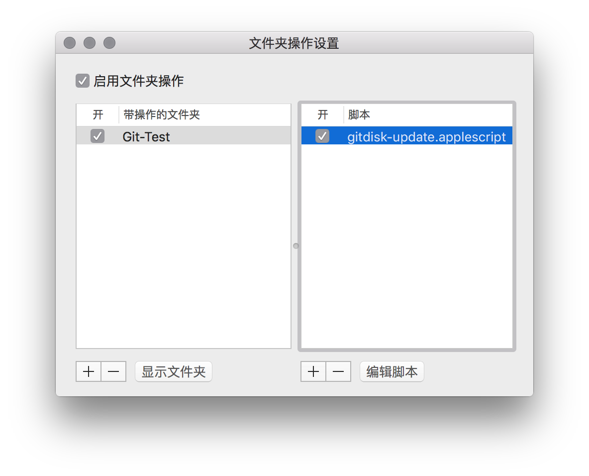

<!--
create time: 2016-02-18 20:06:21
Author: amoblin

This file is created by Marboo<http://marboo.io> template file $MARBOO_HOME/.media/starts/default.md
本文件由 Marboo<http://marboo.io> 模板文件 $MARBOO_HOME/.media/starts/default.md 创建
-->

# 需求背景

设计师MM需要给开发GG切图，产品MM要给开发GG和设计师MM各种PRD文档，如何方便快速地同步文件呢？抛开QQ微信等IM和Email等传统方式，基于文件夹的现有解决方案有：

1. 各种国内盘
2. Dropbox
3. BitTorrent Sync

这3种解决方案都不够理想：

1. 国内盘的问题有3：信息的隐私安全，没有企业级部署方案，成本太高。
2. Dropbox在国内无法正常使用，要让所有参与者都使用VPN是不现实的。
3. BitTorrent Sync可以说是目前最好的选择了：局域网P2P同步，没有隐私安全问题，普通免费版就够日常开发使用了，而且速度快。但我们在使用过程中发现总是出现丢文件的问题，个人怀疑是P2P的技术架构的问题导致，无法从根本上避免。

在使用了一年多BitTorrent Sync以后，在今天吃晚饭的时候终于决定自己开发一款满足以下需求的产品：

1. 隐私安全，局域网同步
2. 稳定，不丢文件
3. 速度快
4. 操作简单，不需要懂太多技术

而这就是[GitDisk](https://github.com/amoblin/gitdisk)。

# [GitDisk：基于Git的网盘式文件同步工具](https://github.com/amoblin/gitdisk)

GitDisk的特点如下：

1. 基于Git库做同步
2. 稳定，不丢文件，可访问历史
3. 配合局域网Gitlab等，同步速度快
4. 操作简单，只需要拖拽文件到文件夹里即可
0. 目前只支持OSX系统

具体如何使用呢？且看下文。

# 安装GitDisk（这一步由开发GG来协助，这是一劳永逸的配置）

```
sh -c "$(curl -fsSL https://raw.githubusercontent.com/amoblin/gitdisk/master/install.sh)"
```

# Gitlab和Git配置（这一步由开发GG来协助，这是一劳永逸的配置）

在产品MM或设计师MM的电脑上配置好公私钥对，以及Gitlab账号的访问权限，确保能够免密进行push。

# Git库初始化（这一步由开发GG来协助，每个Git库配置一次即可）

在Gitlab上创建一个git库，用于存放产品文档或切图等资源

git clone下来上述git库，注意使用ssh协议，以保证接下来可以直接push更新仓库。

这些开发GG都懂滴~好机会注意把握哦~

# GitDisk文件夹配置

1. 选中Git库文件夹，右键->服务->文件夹操作设置
<br/>

2. 出现文件夹操作设置窗口如下：
<br/>

3. 点击底部右边的“+”号，选取要附加的脚本，选择gitdisk.applescript
<br/>

4. 选择完后，右边会出现刚才选择的脚本
<br/>

5. 勾选左上角的“启用文件夹操作”，点击"是"
<br/>

6. 最后的设置界面是这样的
<br/>

配置完毕，接下来就是日常使用了。

# GitDisk使用（产品MM或设计师MM操作）

向Git库文件夹中添加文件即可，方式随意。

# 获取到新添加的文件

```
git pull
```

就酱紫~

gitdisk GitHub地址：https://github.com/amoblin/gitdisk

欢迎star, fork or pull request or giving suggestion!
